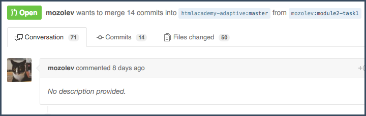
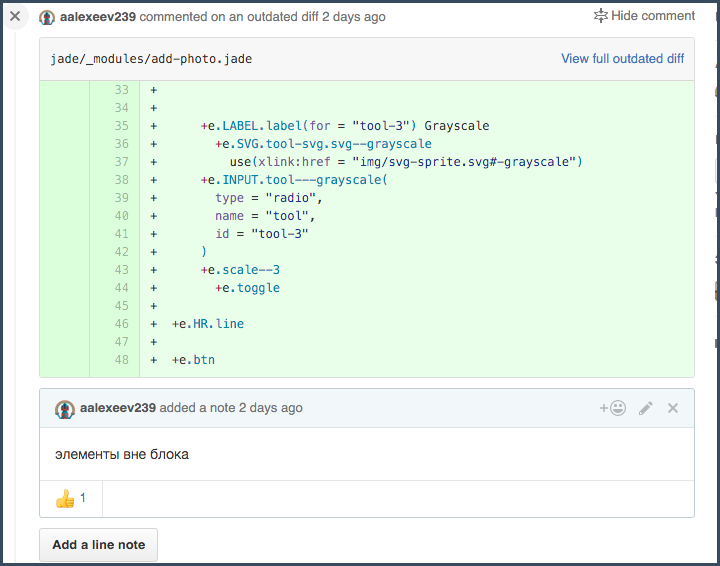
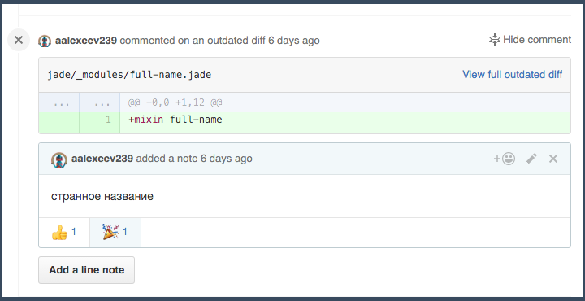
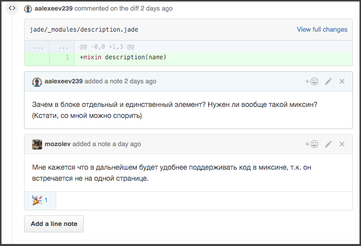
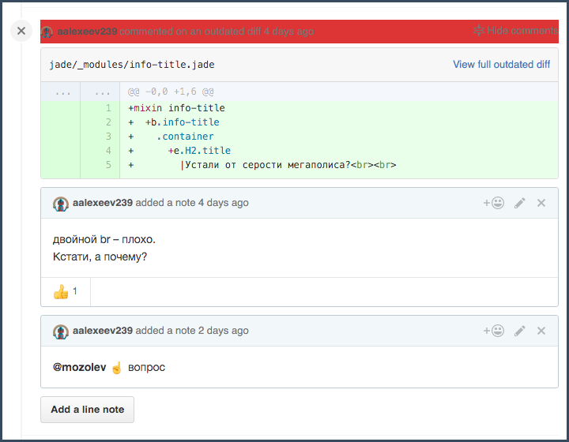

# Cистема общения в пул реквестах:

1) Комментируем построчно в `files changed`, общаемся в `conversation`:

  

2) Студент, пофиксив правку, может поставить реакцию, например :+1:. Так он сигнализирует, что можно проверять:

  

3) Когда вновь просматриваем ПР, открываем старые комментарии. Если все ок, ставим под ним реакцию :tada: (договоритесь со студентом, что эту реакцию ставит только наставник):

  

4) Если не ок, то делаем через `Add a line note` новый комментарий. И так далее, покаправка не будет зачтена, через  реакцию :tada:

  

5) Число правок обычно идет на десятки. Гит при смене кода скрывает комментарии, и каждый раз заново раскрывать каждый коммент — не комильфо. Поэтому я написал скрипт, который пробегается по всем закрытым комментариям и показывает непринятые ( где в последнем комментарии не стоит значок :tada: ) Все, что нужно — оформить [скрипт](index.js) как букмарклет:

P.S.: Да, скрипт страшный :bowtie:
